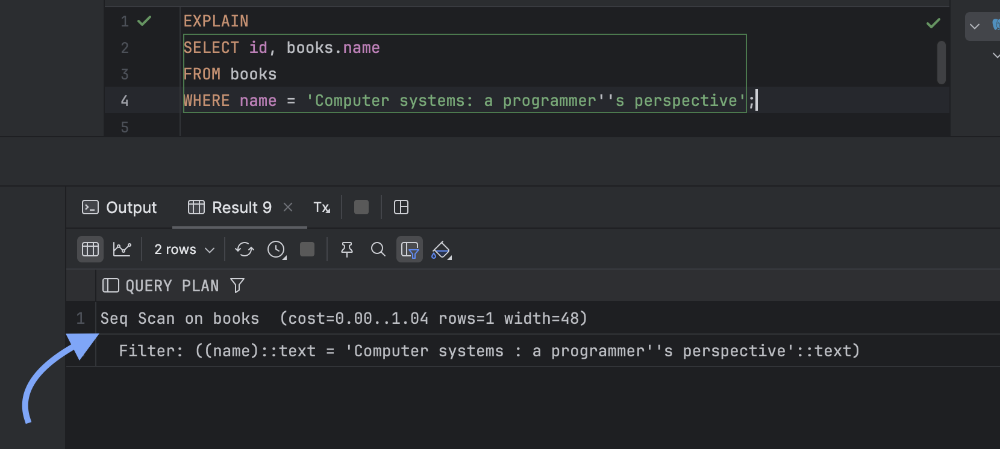

# Indexes

<!-- @formatter:off -->
<!-- TOC -->
* [Indexes](#indexes)
  * [Intro](#intro)
  * [Optimization](#optimization)
    * [Index-Only Scan](#index-only-scan)
    * [Indexing Foreign keys](#indexing-foreign-keys)
    * [Partial indexes](#partial-indexes)
    * [Clusterization](#clusterization)
    * [Fillfactor](#fillfactor)
  * [Concepts](#concepts)
    * [Index is](#index-is)
    * [Partial indexes (WHERE)](#partial-indexes-where)
    * [Covering indexes (INCLUDE)](#covering-indexes-include)
    * [Clusterization](#clusterization-1)
    * [Index fillfactor](#index-fillfactor)
    * [Reindex](#reindex)
  * [Index types](#index-types)
    * [B-tree (default, most common).](#b-tree-default-most-common)
      * [Best for](#best-for)
      * [Advantages](#advantages)
      * [Disadvantages](#disadvantages)
      * [Typical fields](#typical-fields)
      * [Notes](#notes)
    * [HASH](#hash)
      * [Best for](#best-for-1)
      * [Advantages](#advantages-1)
      * [Disadvantages](#disadvantages-1)
      * [Typical fields](#typical-fields-1)
    * [GIN (Generalized Inverted Index)](#gin-generalized-inverted-index)
      * [Best for](#best-for-2)
      * [Advantages](#advantages-2)
      * [Disadvantages](#disadvantages-2)
      * [Typical fields](#typical-fields-2)
      * [Notes](#notes-1)
    * [BRIN (Block Range Index)](#brin-block-range-index)
      * [Best for](#best-for-3)
      * [Advantages](#advantages-3)
      * [Disadvantages](#disadvantages-3)
      * [Typical fields](#typical-fields-3)
    * [GiST (Generalized Search Tree)](#gist-generalized-search-tree)
    * [SP-GiST (Space-Partitioned GiST)](#sp-gist-space-partitioned-gist)
    * [Bloom index (bloom extension)](#bloom-index-bloom-extension)
      * [Best for](#best-for-4)
      * [Advantages](#advantages-4)
      * [Disadvantages](#disadvantages-4)
      * [Typical fields](#typical-fields-4)
      * [Notes](#notes-2)
<!-- TOC -->

## Intro

This document contains information about index-related optimization with examples.

Section [Concepts](#concepts) is being referenced from documentation to keep index related ideas in a single place.\
Still, [Index is](#index-is) section is the good place to start from if the reader is not familiar with indexes.\
Or the reader can just straight to the section Optimization. 

Section [Optimization](#optimization) covers actual optimization tips.

Section [Index types](#index-types) covers different indexes and the best places each index can be used.

## Optimization

### Index-Only Scan

[The Postgres Planner](https://www.interdb.jp/pg/pgsql03/01.html#314-planner-and-executor) may choose a _Sequential Scan_,
_Index Scan_, _Index-Only Scan_ or _Bitmap Index Scan_ to find candidate row locations,
then [Executor](https://www.interdb.jp/pg/pgsql03/01.html#314-planner-and-executor) fetch the table rows.

Command `explain` helps to determine what scan type is used. Is index utilized or not. For example:

```sql
EXPLAIN
SELECT id, name
FROM books
WHERE name = 'Computer systems: a programmer''s perspective';
```



The difference between _Index Scan_ and _Index-Only Scan_ is that during
_Index Scan_ the Executor fetch additional data from table, but during
_Index-Only Scan_ the Executor fetches data only from index.

[Covering index](#covering-indexes-include) may be used to enforce _Index-Only Scan_:

```sql
CREATE INDEX ON tab (col1)
  INCLUDE (col2);
```

### Indexing Foreign keys

Index on _Foreign key_ can:

* Improve performance of joins.
* Improve performance when making changes to a referenced table.
  DB ensures consistency of rules, therefore update/delete of a referenced table row can lead to usage of the index.

### Partial indexes

This method can help to reduce index bloat and increase performance in rare cases.

Create an index using

```sql
CREATE INDEX ON tab (col)
  WHERE <predicate>;
```

Pros & cons and use cases [are described here](#partial-indexes-where).


### Clusterization

From time to time a table data can be rewritten and clustered accordingly to index needs:

`CLUSTER table USING index`

Pros & cons and use cases [are described here](#clusterization-1).

### Fillfactor

Low `fillfactor` for write-heavy operations to delay page split or high `fillfactor` for static indexes.
Actually, static indexes means that the table columns they're built on are static.\

```sql
CREATE INDEX idx ON t USING btree (k) WITH (fillfactor = 80);
```

OR

```sql
ALTER INDEX idx SET (fillfactor=95);
REINDEX INDEX idx;
```

Details [are described here](#index-fillfactor).

## Concepts

### Index is

A PostgreSQL index is a separate **on-disk** data structure that provides a faster path to locate rows than scanning the
whole table.
Conceptually, an index stores:

* Search keys (derived from one or more **columns** or **expressions**), plus
* A pointer to the table row or `TID`.
  TID consists of block number + offset within the block. For example, `(42,9)` means that the item is the ninth
  element in the
  43rd 8KB block of the table or index (blocks are counted from 0).

**Indexes accelerate reads but add write costs!**
Therefore, they should be used on tables with high read/write ratio.

* _INSERT_: add index entries.
* _UPDATE_: may add new entries (and sometimes remove old ones logically).
* _DELETE_: leaves “dead” entries until cleanup.
  This is why autovacuum/vacuum and reindexing considerations matter operationally.

### Partial indexes (WHERE)

A partial index is an index built on the subset of table rows that satisfy a `WHERE` predicate defined at index creation time.

```sql
CREATE INDEX ON orders (created_at)
  WHERE status != 'open';
```

Pros:

* Smaller disk and cache usage, less page reads.
* Improves plan quality.
* Lower write-query overhead.

Cons:

* Index can't be used unless predicate statement if fulfilled.
* Changes in application data can lead to reduced effectiveness over time (if predicate is volatile).
  For example, now most of the fields use status `open`, but not `initiated` or `closed`.
* Multiple partial indexes may increase planning complexity, therefore decrease performance.

Use cases:

* Status. If most of the records are marked as `finished`. In such a case index can use `WHERE status != finished` 
  or `WHERE status = open`.
* Soft deletes. Mark deleted record as `deleted_at = NOW()`. Index may use `WHERE deleted_at IS NULL`.
* Sparse columns. When column have a lot of nulls it's a great opportunity to reduce index disk consumption. Like, `WHERE email IS NOT NULL`.
* Uniqueness only for active rows. For example, _unique_ usernames among _active_ users.

Official documentation [is here](https://www.postgresql.org/docs/current/indexes-partial.html).

### Covering indexes (INCLUDE)

**A covering index** is an index that contains all columns needed to satisfy a query (for filtering, joining or output), 
so the _executor_ can return rows without reading the table (heap).

This covering index:

```sql
CREATE INDEX ON users (email)
  INCLUDE (phone);
```

can help with a query like `SELECT email, phone FROM users WHERE email = 'email@gmail.com'`.
Most probably the planner would use Index-Only Scan here.

Pros:

* Less heap reads.
* Better cache efficiency. Covering index can remove hot-paths from cache entirely, therefore emptying space for other entries.
* `INCLUDE` columns only uses space, but doesn't affect performance, since it's not a part of actual indexation.

Cons:

* Adding columns to index increases the index storage consumption.
* Even higher write-operation overhead. Columns have to be processed not only for a table, but for an index.
* Index-only scans are not guaranteed on tables with low read/write operations ratio.
* Maintenance complexity. It's hard to tune without production data.

Use case for this index is where win is measured based on: _space-consumption_ (the best scenario is small columns),
and _read/write ratio_.

Official documentation [is here](https://www.postgresql.org/docs/current/indexes-index-only-scans.html).

### Clusterization

**Sequential Scan** is not necessary bad.
Postgres can utilize indexes along with sequential scan to boost performance.

`CLUSTER` is a PostgreSQL operation that physically rewrites a table to match the order of a specified index.
This can reduce random access to table and utilize sequential scan when needed.
Also, this operation allows to fetch more useful data from a single table page, therefore _scan less pages_ than with random ordering.

It works similarly to `VACUUM FULL`. The main difference that `CLUSTER` not only reduces bloat, but also changes structure of a table.


`CLUSTER` is **not self-maintaining**: subsequent inserts/updates will gradually erode the physical ordering,
so clustering is best treated as a periodic maintenance action.

How it works:

* `CLUSTER` operation fully rewrites table to another place, similarly to `VACUUM FULL`.
* After run of `CLUSTER table USING index` that index is stored in metadata and later can be used by `CLUSTER table`.

Pros:

* Faster range scans.
* Improved cache efficiency. 
* Bloat decrease side effect. Full rewrite of the table removes **dead tuples**.
* Can improve planner cost estimates.

Cons:

* Requires full table lock. Similarly to `VACUUM FULL`. Sometimes it can be _impossible_ for production environments.
* Not self-maintaining. `CLUSTER` command adds operational overhead: 
  proper frequency, time, factors for execution have to be selected.
* Heavy operation. It leads to full table rewrite, hence the bigger the table the more I/O needed.

Use cases:

* Time-based access, e.g. `WHERE created_at < CURRENT_DATE - 7`.
* Multi-tenant table with field like `tenant_id`.
* OLAP (Online Analytical Processing) where batch processing can suffocate from high I/O.
* Improving [BRIN](#brin-block-range-index) effectiveness.

Analyzation:

Postgres can show data correlation for columns.
Execute after [analyze](TODO):

```sql
SELECT tablename, attname, correlation 
FROM pg_stats 
WHERE tablename IN ('table', 'names') 
ORDER BY tablename, attname;
```

Values in the column `correlation` can be in range [-1, 1], this means:
* Near +1: rows are physically ordered in ascending order.
* Near -1: rows are physically ordered in descending order.
* Near 0: random physical order.

In short, `-1` or `+1` mean that data **is clustered**.
Official explanation [is here](https://www.postgresql.org/docs/current/view-pg-stats.html) (look for `correlation`).

Official documentation [is here](https://www.postgresql.org/docs/current/sql-cluster.html).

### Index fillfactor

`fillfactor` is an indexes parameter that can be used in `WITH` clause _only_ for [B-tree](#b-tree-default-most-common), 
[HASH](#hash), [GIST](#gist-generalized-search-tree) and [SP-GIST](#sp-gist-space-partitioned-gist) indexes.

**B-tree** index is constructed of leaves (as pages 8kB), while **HASH** of buckets (8kB), but they share similar idea:
they are a pile of pages structured in different ways.

`fillfactor` tells Postgres how tight should a single page be packed.

When an index is created or command `REINDEX` is executed Postgres tries to fill the pages up to specified `fillfactor` percentage.
For example, 30% `fillfactor` would pack leaves to 8kB * 0.3 = 2.4kB, leaving 5.6kB for future usage.

Inserting new values to index can lead to **overflow of a page**.
When an incoming index tuple cannot fit on the target page, the page is **split**:
a new sibling page is allocated and some tuples are moved to that page from old one.\
Different index types split pages differently, the details are not described here.

Default fillfactors:
* B-tree: 90 (BTREE_DEFAULT_FILLFACTOR [here](https://doxygen.postgresql.org/nbtree_8h_source.html))
* HASH: 75 (HASH_DEFAULT_FILLFACTOR [here](https://doxygen.postgresql.org/hash_8h_source.html))
* GIST: 90 (GIST_DEFAULT_FILLFACTOR [here](https://doxygen.postgresql.org/gist__private_8h_source.html)) 
* SP-GIST: (SPGIST_DEFAULT_FILLFACTOR [here](https://doxygen.postgresql.org/spgist__private_8h_source.html))

Available range for `fillfactor` is `[10; 100]`.

Pros of lower `fillfactor` (<60%):

* Less or delayed page splits, therefore less operational overhead.

Cons of lower `fillfactor` (<60%):

* Larger index size (space consumption).
* Build time, reindex time, vacuum time can increase.

Use cases:
* 100% `fillfactor` for totally static indexes (no updates/deletes). This can reduce storage consumption on big indexes.
* Low `fillfactor` for write-heavy operations (insert/update/delete) on a table. Need to tune carefully based on production data.
* For OLTP load an index can be initially created with lower `fillfactor`, but then monitored for a bloat 
  and `ALTER`ed + `REINDEX`ed.

There's an optimization related to [table fillfactor](uncategorized.md#table-fillfactor).

### Reindex

TODO

## Index types

### B-tree (default, most common).

Name stands for: multi-way balanced tree.

#### Best for

General-purpose indexing: equality, range queries, and sorting (=, <, <=, >, >=, BETWEEN, ORDER BY, prefix LIKE 'abc%').

#### Advantages

* Default and most well-optimized index type in PostgreSQL
* Supports ordering and range operations (can satisfy ORDER BY and range filters).
* Supports multi-column indexes with _left-to-right matching rules_ (explained below).
* This is default index for PRIMARY KEY and UNIQUE.

#### Disadvantages

* Can become large for wide keys or many columns, increasing memory and I/O.
* Not ideal for very low-selectivity columns alone (e.g., boolean flags).
* Does not natively handle “contains” semantics for arrays/jsonb/text search (
  see [GIN index](#gin-generalized-inverted-index)).

#### Typical fields

Integers, timestamps, UUIDs, numeric, short text.

#### Notes

**_Left-to-right matching rules:_**

If we have the table:\
`CREATE TABLE my_table(col1 INT, col2 INT, col3 INT)`

and we have the next index:\
`CREATE INDEX my_table_idx on my_table(col1, col2, col3);`

Then next queries can use index:

```sql
SELECT FROM my_table WHERE col1 < 5;
SELECT FROM my_table WHERE col1 < 5 AND col2 > 10;
SELECT FROM my_table WHERE col1 < 5 AND col2 > 10 AND col3 <= 25;
```

But these queries can **not**:

```sql
SELECT FROM my_table WHERE col2 < 10;
SELECT FROM my_table WHERE col3 <= 25;
SELECT FROM my_table WHERE col2 < 10 AND col3 <= 25;
```

### HASH

Implementation of the [hash table](https://en.wikipedia.org/wiki/Hash_table) data structure.

#### Best for

Equality (`=`) only.

#### Advantages

* Optimized for fast `=` operator lookup.
* Implementation is [WAL-logged](https://www.postgresql.org/about/featurematrix/detail/wal-support-for-hash-indexes/) in
  PostgreSQL 11+, so it is crash-safe.
* Historically less preferred.
* Index size can be slightly more compact than a comparable **B-tree** in some workloads.
* Useful when **B-tree** has a lot of collisions (after profiling).

#### Disadvantages

* Only supports `=`.
* No `ORDER BY` support.
* **B-tree** usually performs **similarly** for equality while also supporting more operators.
* Historically less mature and less used than **B-tree**; fewer real-world tuning examples.
* No multi-column support.

#### Typical fields

Anything with direct comparison (IDs, lookups, etc.).

### GIN (Generalized Inverted Index)

#### Best for

“Contains” queries on multi-valued fields.

#### Advantages

* Good for `jsonb` (`@>`, `<@`, `?`, `?|`,
  `?&`). [Details here](https://www.postgresql.org/docs/9.4/functions-json.html).
  It indexes individual keys/values inside JSON, not just the whole document
* Good for `arrays` (`@>`, `<@`, `&&`). [Operators are here](https://www.postgresql.org/docs/8.3/functions-array.html).
* Supports **full-text search** (`tsvector @@ tsquery`).
  [Text search types](https://www.postgresql.org/docs/current/datatype-textsearch.html).
  [Text search functions and operators](https://www.postgresql.org/docs/current/functions-textsearch.html).

#### Disadvantages

* GIN often creates very large indexes, because it stores multiple entries per row (one per term/element).
  This can impact disk, memory, and backup size.
* Speaking of index size, it also affects write operations.
  It can be noticeably slower than **B-tree**.
* Not for ranges or sorting. This index is for containment, not for ordering.
*

#### Typical fields

`jsonb`, `text[]`, `int[]`, `tsvector`.

#### Notes

If it's possible to move data into normal columns, then **B-tree** index can be simpler and cheaper.

### BRIN (Block Range Index)

#### Best for

Very large tables where values are correlated with physical order.
Useful for logs, metrics, and archival data.

#### Advantages

* Great for **time-series** and **append-only** data.
* Small size. BRIN stores summary information per block range, not per row.
* Fast to _build_ and _reindex_.
* Useful for partitioning.
  On partitioned tables with nicely ordered data, BRIN can be an effective “first filter” before scanning partitions.

#### Disadvantages

* Not precise, gives only approximate estimation for number of blocks (pages).
* Useless on unordered data.
* Not helpful on small tables.
* Doesn't help with sorting.

#### Typical fields

* Append-only (like `created_at`).
* Sequentially incrementing IDs.
* Columns with strong correlation to insertion order.

### GiST (Generalized Search Tree)

GiST is a flexible framework used by extensions (like PostGIS) to index geometric objects and support operations like
“intersects” or “overlaps”.

### SP-GiST (Space-Partitioned GiST)

Data that naturally fits into **tree-like structures**, like network types with prefix-based queries.

### Bloom index (bloom extension)

#### Best for

**Large tables** with many columns where queries use many equality conditions (`=`) on different columns AND it's not
possible to predict combination of fields.

#### Advantages

* Handles many columns in one index. It's okay for use 10+ columns in a single Bloom index.
* Compact per-row storage.
  Each row is represented by a fixed-size bitset (a signature).
  Index size grows mostly with row count, not with total column width.
  Larger signature works better (less false positives), but consumes more storage and increases time to scan.
* Flexible for many combinations of predicates.
  Index on `(a, b, c, d, e, f, g, h, i, j)` can be used with any combination of columns using `=`.

#### Disadvantages

* **False positives.**
  In worst-case scenario index returned positive, then postgres scanned heap and found nothing.
* Only supports `=`. No `ORDER BY` support. Similarly to [HASH](#hash) index.
* Complex to tune
  [parameters](https://www.postgresql.org/docs/current/bloom.html#BLOOM-PARAMETERS)
  like **bitset length** and **number of hash bits per column**.
  Bad choices can lead to either many false positives or wasted space.
* It's an extension. Not built-in by default.

#### Typical fields

A set of low to medium cardinality fields with unpredictable ordering.

#### Notes

Answers to question "Can this row **possibly** match **all** these filters?"

Documentation [is here](https://www.postgresql.org/docs/current/bloom.html).
